# Azure Active Directory Configuration

Any application accessing Azure resources on behalf of a user requires an Azure Active Directory (AAD) application registration. CollectSFData accesses Azure Data Explorer (Kusto) or Azure resource information if using Log Analytics. For CollectSFData to function, an AAD app registration is required. CollectSFData parameter 'azureClientId' is set to the app registration 'Application (client) ID' guid value. Use steps below to setup Azure app registration for use with CollectSFData.

## Create Azure Active Directory Application Registration

The following describes how to create an AAD app registration for use with CollectSFData for access to Azure resources and Kusto. Only required settings are configured for a default Azure subscription. Additional settings may be required for different environments.

**NOTE: these steps may require AAD administrative permissions to complete depending on the configuration of Azure environment and configuration being set below.**

1. Open Azure portal https://portal.azure.com and navigate to 'Azure Active Directory' blade https://portal.azure.com/#blade/Microsoft_AAD_IAM/ActiveDirectoryMenuBlade/Overview  

    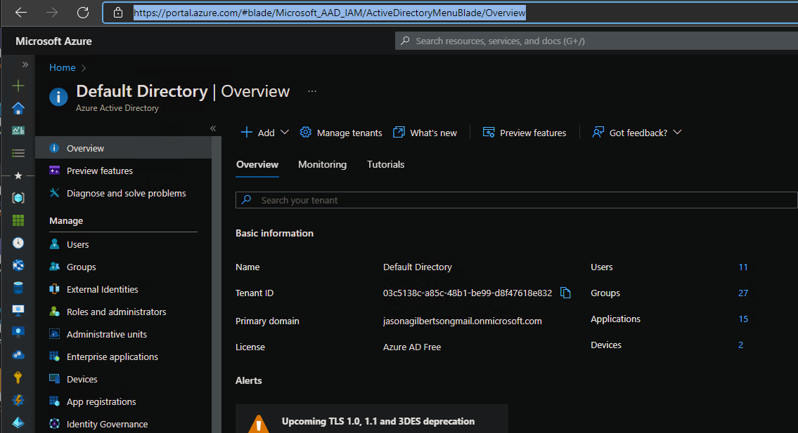

1. Select 'App registrations', 'New registration' https://portal.azure.com/#blade/Microsoft_AAD_IAM/ActiveDirectoryMenuBlade/RegisteredApps.  

    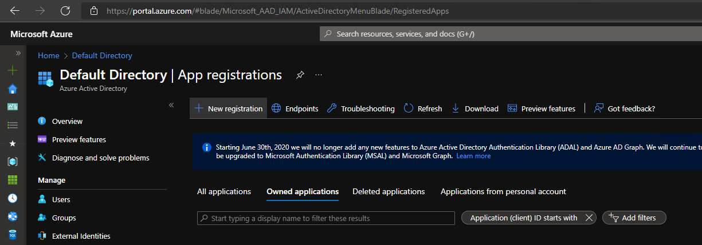

1. Enter a descriptive name for new registration and 'Register'. In this example 'collectsfdata service fabric data collection' is used.  

    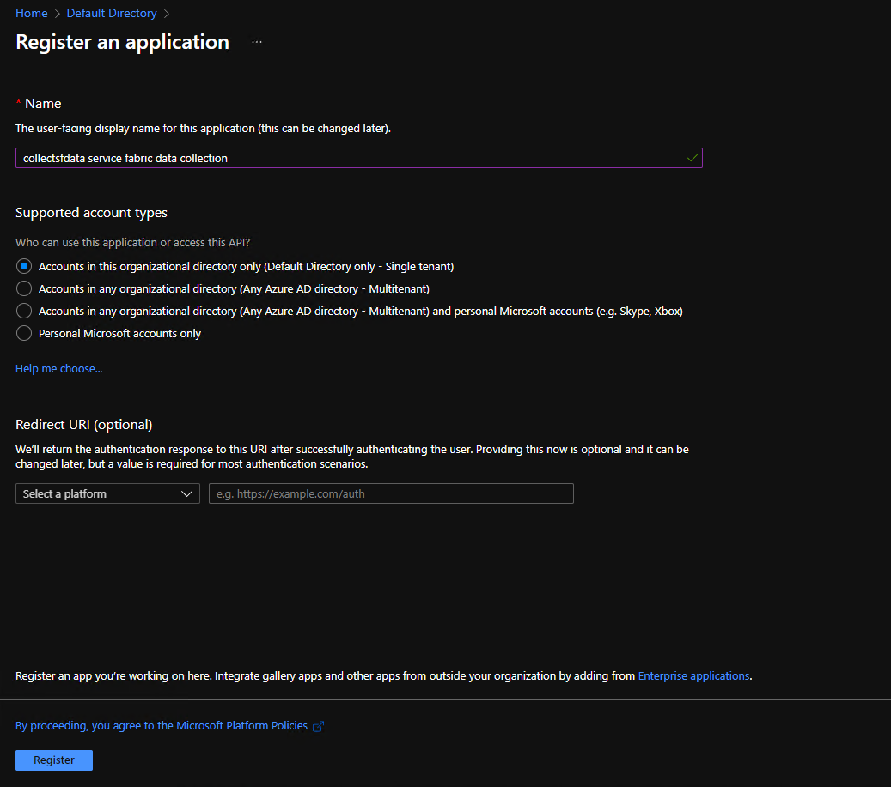  

1. After app is registered, select 'Authentication', 'Add a platform'.  

    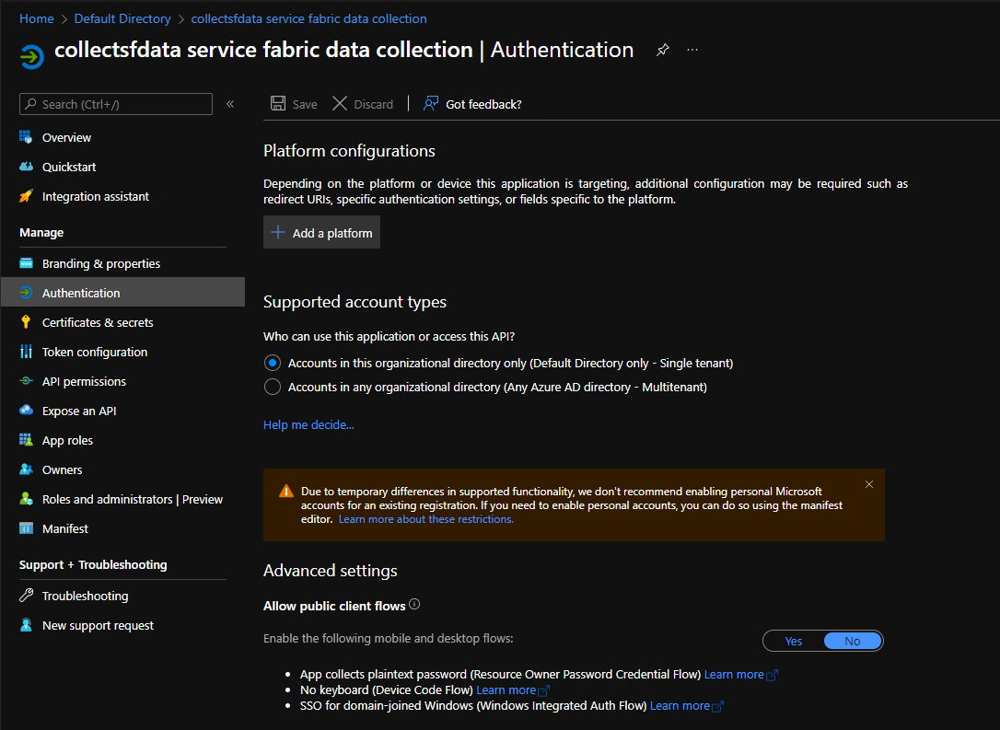

1. Select 'Mobile and desktop applications'

    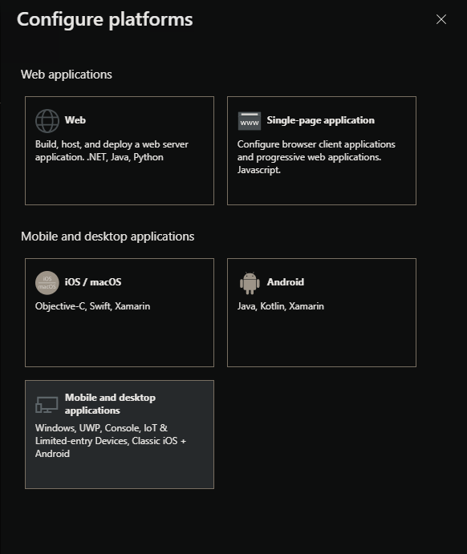

1. Select 'https://login.microsoftonline.com/common/oauth2/nativeclient' for the 'Redirect URIs' and 'Configure'.  

    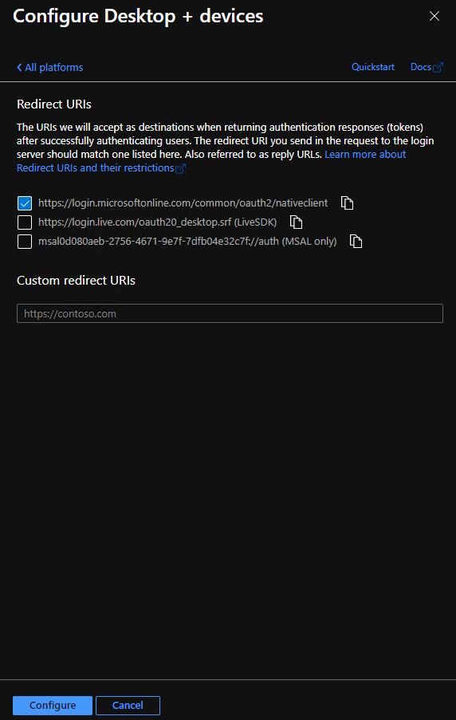

1. Authentication configuration should be configured same / similar to below.

    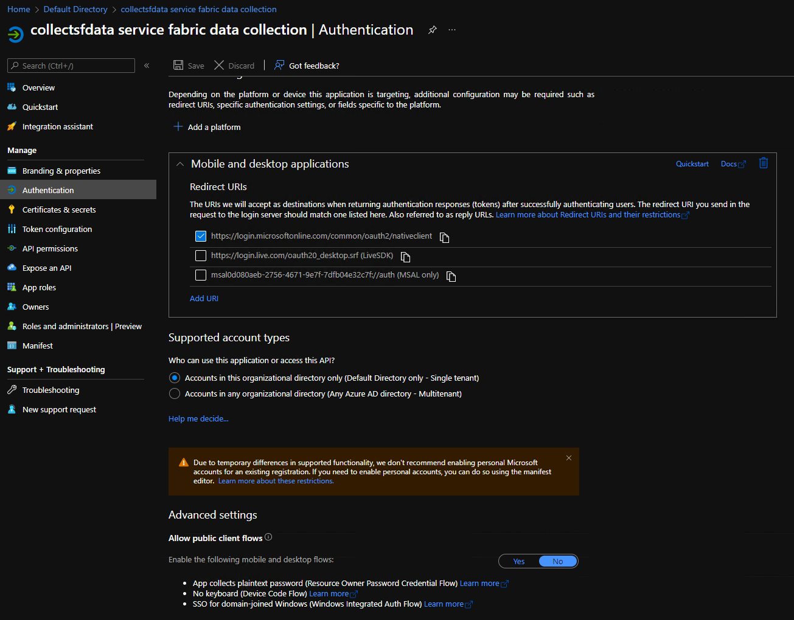

1. Select 'API permissions' to modify permissions. By default, 'User.Read' permissions are already added.

    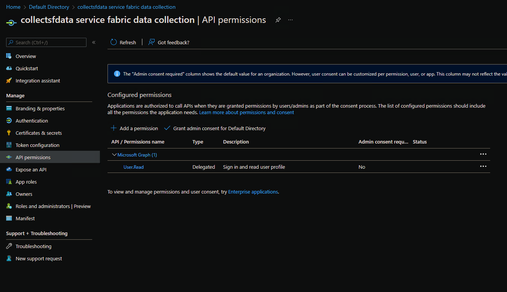

1. Select 'Add a permission', then 'Azure Data Explorer' Microsoft Api.

    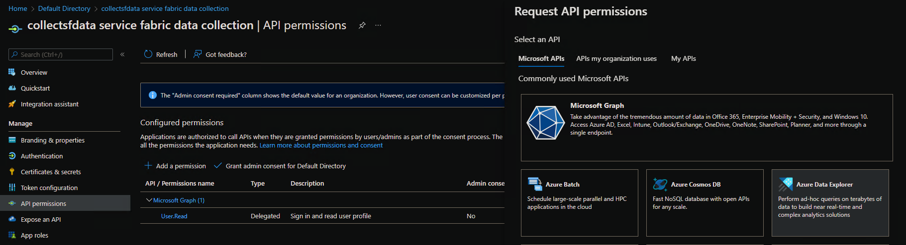

1. Select 'user_impersonation' under 'delegated permissions', then 'Add permissions'.

    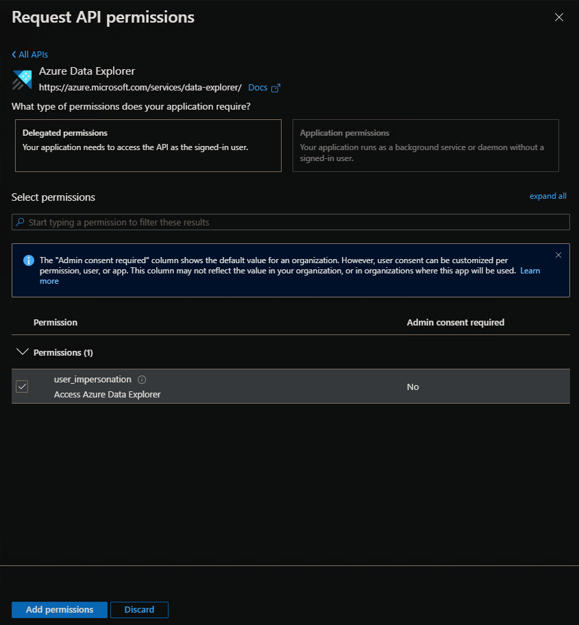

1. After Kusto permission is added, API permissions should be configured as below.

    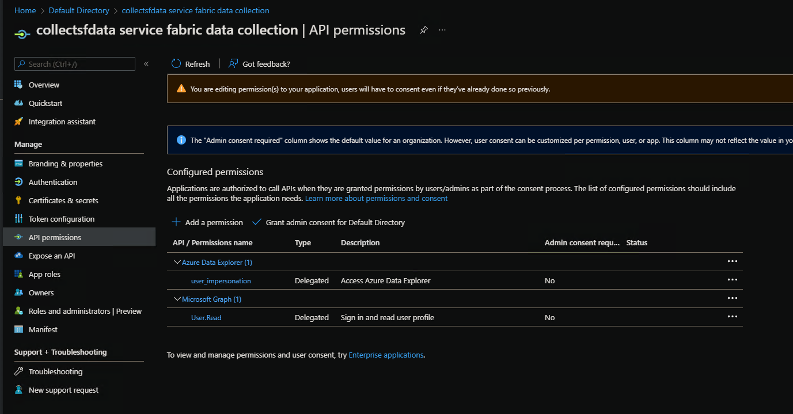

1. After app registration has been created, copy the 'Application (client) ID' guid value. Set CollectSFData parameter 'azureClientId' to the guid value and optionally 'azureazureClientCertificate' to certificate base64 value. These values can be done via command line or json configuration file. See [configuration](./configuration.md).

## (Optional) Add certificate as a client secret to app registration for non-interactive authentication

For environments where CollectSFData utility executes non-interactively, for example if utility is called from a service, a client secret can be used to prevent interactive authentication prompt. Best practice is for a certificate to be used as a secret. If needed, use the steps below to add a certificate to app registration for use with non-interactive logon.

1. Navigate to new app registration in azure portal and select 'Certificates & secretes'.  

    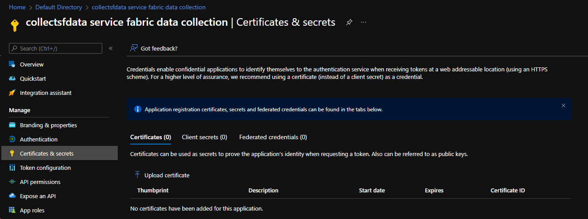

1. Select 'Upload certificate' to upload an existing certificate. If a certificate from a CA is unavailable, these steps can be used to create a self-signed test certificate: https://docs.microsoft.com/en-us/azure/active-directory/develop/howto-create-self-signed-certificate

1. To configure CollectSFData to use certificate, copy the base64 string of the certificate uploaded to app registration and use as value for 'azureClientCertificate' parameter. See [configuration](./configuration.md).

## (Optional) Configure app registration AD / AAD Group(s) to restrict access

To restrict which users have access to app registration (collectsfdata), from the 'API Permissions' view, select 'Enterprise applications' or select [Enterprise Applications](https://portal.azure.com/#blade/Microsoft_AAD_IAM/StartboardApplicationsMenuBlade/AppAppsPreview/menuId/) from root of AAD blade. Select 'Users and Groups' to add specific users or groups.

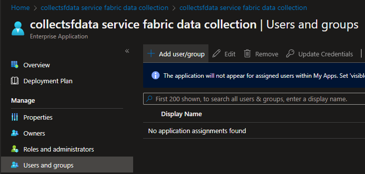

NOTE: Using groups for permissions does require at least P2 level of Azure Active Directory.

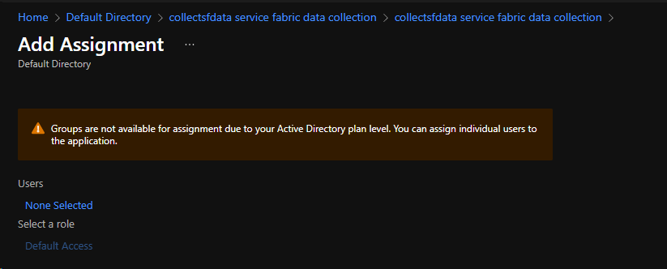

## Add app registration to Kusto cluster and database

Once app registration has been created and configured, the new app registration needs to be added to the kusto database permissions. Refer to https://docs.microsoft.com/azure/data-explorer/create-cluster-database-portal on how to create a kusto cluster and database if one has not been created.

**NOTE: Azure Data Explorer / Kusto is not free. See https://azure.microsoft.com/en-us/pricing/details/data-explorer/**

1. In azure portal https://portal.azure.com, navigate to the kusto cluster database to be used to store service fabric diagnostic data.
1. Select 'Permissions', 'Add', and a user type with rights to create, ingest, and read. 'User' rights are used for this configuration. Detailed permission definitions are located here https://docs.microsoft.com/azure/data-explorer/kusto/management/security-roles.

    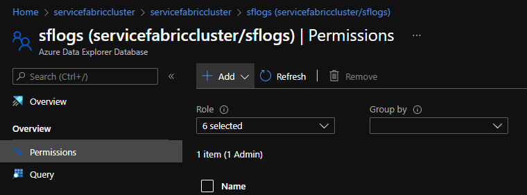

    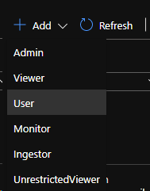

1. Search for the new app registration created above, select, and click 'Select'.  

    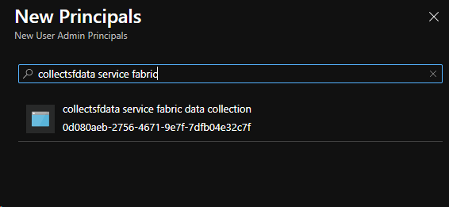

1. Set the kusto cluster 'Data Ingestion URI' ingest url *with* database name appended for the value of 'kustoCluster' parameter to use with CollectSFData. Using example from above: 'https://ingest-servicefabriccluster.eastus.kusto.windows.net/sflogs'. See [configuration](./configuration.md).

    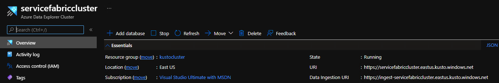

## Application consent

By default, app registrations are configured to prompt one time either per application or per user to request consent. This can be changed in 'API permissions' of the app registration. This operation requires admin permissions in AAD.

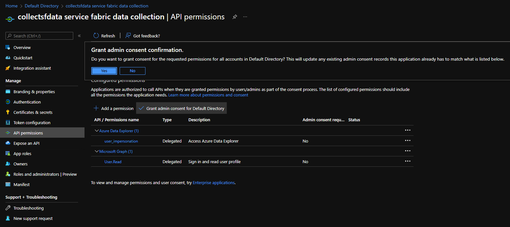

With the default setting to prompt, the following will be displayed upon the first successful logon. Selecting 'Consent on behalf of your organization' will prevent this prompt from displaying for any other users.  

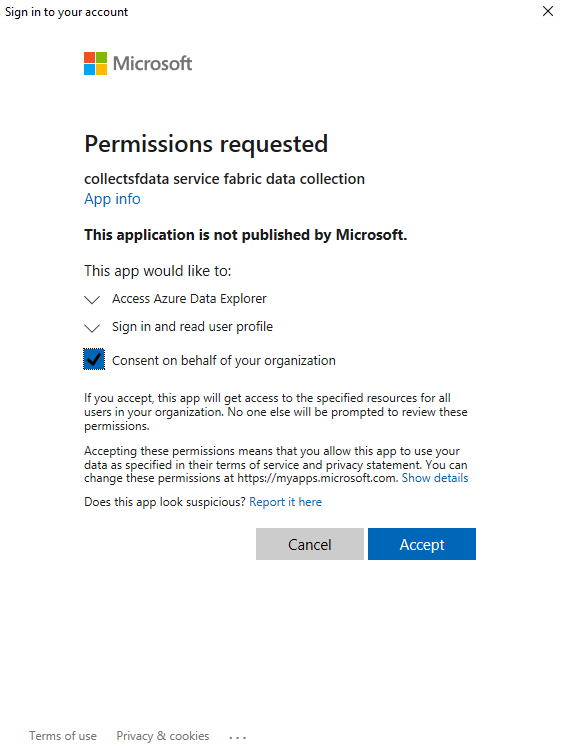

## Troubleshooting

If app registration creation or api permission configuration fails, it is most likely due to insufficient permissions or Azure / AAD policy. Additional information should be available in the portal as to reason of failure. 

Enabling verbose logging in CollectSFData may help in troubleshooting if errors in portal are not resolving. Set parameter 'logDebug' to 5 and set 'logFile' to path and file name for log file.

## Example CollectSFData json configuration using data from above

```json
{
  "$schema": "https://raw.githubusercontent.com/microsoft/CollectServiceFabricData/master/configurationFiles/collectsfdata.schema.json",
  "AzureClientCertificate": "MIIC8DCCAdigAwIBAgIQeiHV3GWWYplN2Tuha9ueTDANBgkqhkiG9w0BAQsFADALMQkwBwYDVQQDDAAwHhcNMjIwMjEyMTMyMjQ2WhcNMjMwMjEyMTM0M...",
  "AzureClientId": "0d080aeb-2756-4671-9e7f-7dfb04e32c7f",
  "AzureTenantId": "416df1dd-8718-4630-8ac3-f9f41543b794",
  "KustoCluster": "https://ingest-servicefabriccluster.eastus.kusto.windows.net/sflogs",
}
```
