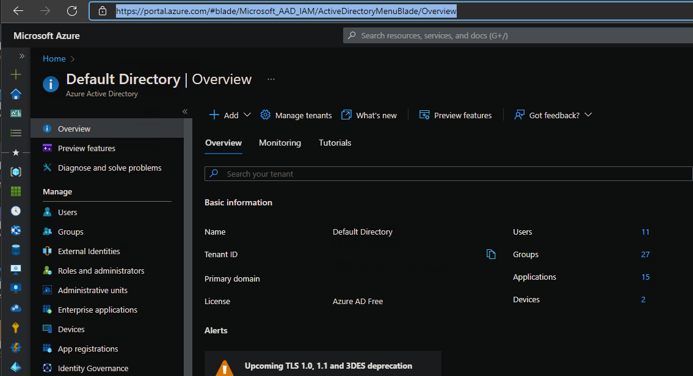

# Azure Active Directory Configuration

Any application accessing Azure resources on behalf of a user requires an Azure Active Directory (AAD) application registration. CollectSFData accesses Azure Data Explorer (Kusto) or Azure resource information if using Log Analytics. For CollectSFData to function, an AAD app registration is required. CollectSFData parameter 'azureClientId' is set to the app registration 'Application (client) ID' guid value. Use steps below to setup Azure app registration for use with CollectSFData.

An existing app registration that is configured for user_impersonation and user.read can be used instead of creating a new registration.

## Create Azure Active Directory Application Registration

The following describes how to create an AAD app registration for use with CollectSFData for access to Azure resources and Kusto. Only required settings are configured for a default Azure subscription. Additional settings may be required for different environments.

**NOTE: these steps may require AAD administrative permissions to complete depending on the configuration of Azure environment**

1. Open Azure portal https://portal.azure.com and navigate to 'Azure Active Directory' blade https://portal.azure.com/#blade/Microsoft_AAD_IAM/ActiveDirectoryMenuBlade/Overview  

    

1. Select 'Add' to create a new application registration.  

    

1. Enter a descriptive name for new registration and 'Register'. In this example 'collectsfdata service fabric data collection' is used.  

1. Select 'Public client' and enter 'http://localhost' for the redirect.

      

1. After creation, select 'API permissions' to modify permissions. By default. 'User.Read' permissions are already added.

    

1. Select 'Add a permission', then 'Azure Data Explorer' Microsoft Api.

    

1. Select 'user_impersonation' under 'delegated permissions', then 'Add permissions'.

    

1. After Kusto permission is added, API permissions should be configured as below.

    

## Configuring CollectSFData to use App Registration

After app registration has been created, copy the 'Application (client) ID' guid value. Set CollectSFData parameter 'azureClientId' to the guid value. This can be done via command line or json configuration file. see [configuration](./configuration.md).

## Troubleshooting

If app registration creation or api permission configuration fails, it is most likely due to insufficient permissions. Additional information should be available in the portal as to reason of failure. 
