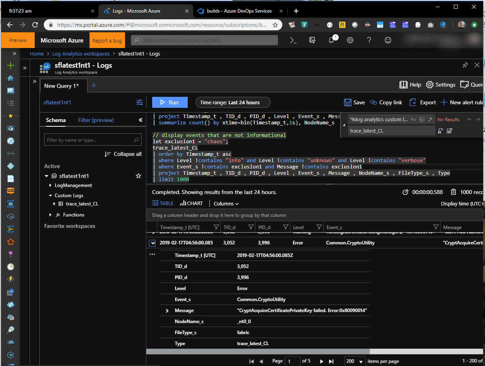

# Log Analytics QuickStart

[log analytics example queries](../docs/logAnalyticsExampleQueries.md)  
[log analytic queries in csl query format](../docs/LogAnalyticsQueries/logAnalyticsExampleQueries.md.csl)  

## Overview

These steps will assist with getting started using collectsfdata and azure log analytics. This example is configured for service fabric .dtr logs used by traceviewer. collectsfdata can import performance and table data from the 'sflogs' customer storage accounts as well with a different configuration. Time from setup of utility to querying a small set of data is around 15 min. This includes, utility download, configuration, log analytics workspace creation, log analytics time to ingest, and returning data from a query.

## Steps
1. download latest version of collectsfdata and extract from [releases](https://github.com/microsoft/CollectServiceFabricData/releases/tag/CollectSFData-latest).
2. create log analytics workspace in [portal](https://portal.azure.com).  

    
3. copy workspace id and key from 'advanced settings'  
    **NOTE: there is currently a bug where you may need to navigate into and out of 'advanced settings' multiple times before information is displayed 02/2019.**

    
4. create and save **'collectsfdata.loganalytics.json'** to working directory using template below. Modify:
    - SasKey - cluster storage sas key
    - LogAnalyticsId - log analytics workspace id
    - LogAnalyticsKey - log analytics key
    - LogAnalyticsName - name / tag for this ingest. for trace files an example: 'trace_00000000000001'. cannot start with a number and will always end with _CL
    - CacheLocation - temporary storage on local machine with 10's GB free
    - StartTimeStamp - start time of trace in utc
    - EndTimeStamp - end time of trace in utc  
    **NOTE: typical trace windows shouldnt exceed a couple of hours due to size of traces and costs for log analytics. Use 'NodeFilter' if needed to reduce size.**

```json
    {
        "GatherType": "trace", // trace, counter, table, exception, setup
        "NodeFilter": null, // regex or string to match blob uri for example node name
        "CacheLocation": "c:\\temp\\trace_latest", // temp storage location. 
        "SasKey": "", // customer 'sflogs' storage account sas
        "StartTimeStamp": "02/16/2019 14:00 +00:00",
        "EndTimeStamp": "02/16/2019 18:30 +00:00",
        "LogAnalyticsId" : "", // log analytics workspace id
        "LogAnalyticsKey" : "", // log analytics workspace primary / secondary key
        "LogAnalyticsName" : "trace_latest" // log analytics custom log 'type' name / tag
    }
```

5. from command prompt in working directory run: **collectsfdata -config collectsfdata.loganalytics.json**
6. open workspace 'custom logs'. in this example, the ingest or custom log 'type' name is 'trace_latest_CL' (_CL is for custom log and is automatically appended by log analytics).
7. verify record count with output.  
	NOTE: this may take a while to complete ingestion even after utility has completed and this does vary regardless of size of ingest
8. use example queries to get started. [log analytics example queries](../docs/logAnalyticsExampleQueries.md) and [log analytic queries in csl query format](../docs/LogAnalyticsQueries/logAnalyticsExampleQueries.md.csl).

    
## Tips

- it is difficult to remove data from workspace once it is in log analytics.
    - it is a rest call with a 30 day sla
    - to manage data delete and create new workspaces as needed which is fast and simple
- a workspace is not needed for every ingest
    - use logAnalyticsName as the name of your ingest / case
    - downside of recreating workspaces however is that any queries that have been saved *will* be lost
    - to work around query saving, an arm template of the queries to be reused across workspaces can be made and applied easily
- log analytics ingest is not free 
    - querying is free
	
## Reference

[vscode extension](https://marketplace.visualstudio.com/items?itemName=josin.kusto-syntax-highlighting)  
[log analytics external pricing](https://azure.microsoft.com/en-us/pricing/details/monitor/)  
[pluralsight KQL](https://www.pluralsight.com/courses/kusto-query-language-kql-from-scratch)
[log analytics query language and playground](https://docs-analytics-eus.azurewebsites.net/index.html)
	
### Azure data explorer kusto (external)

Log analytics is based on kusto technology. Many but *not* all query commands are the same.  
[Azure Data Explorer Documentation](https://docs.microsoft.com/en-us/azure/data-explorer/)
	
### Log analytics (now azure monitor)
[Azure Monitor Documentation](https://docs.microsoft.com/en-us/azure/azure-monitor/)
